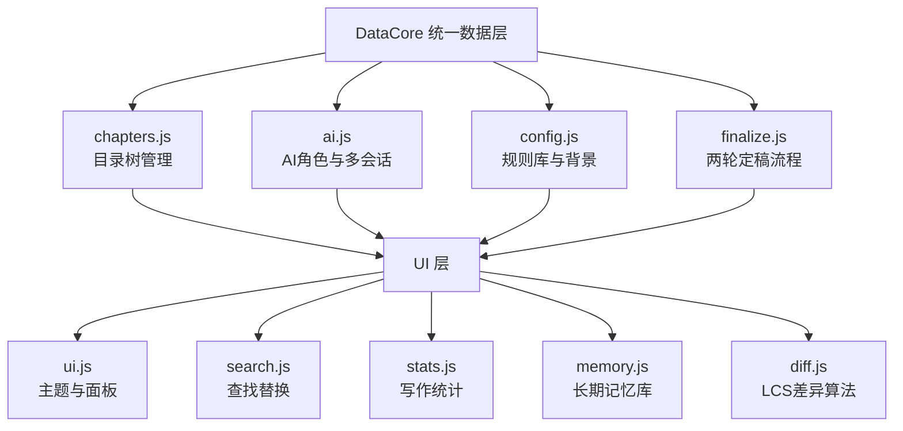

# 落笔 (Luobi)

> 写作内核驱动的 AI 协作写作引擎

[](LICENSE)

**落笔**是一款专注于长篇小说创作的 AI 辅助写作工具。它将你的写作规则编译为 AI 可执行的审查指令，并提供从创作、审稿到定稿的完整工作流。

---

## ✨ 功能

| 模块 | 功能 |
|------|------|
| ✍️ **编辑器** | 专注模式、查找替换、自动保存、字数统计、时速预估 |
| 🤖 **四角色 AI 协作** | 风格审核、剧情锚点、读者审阅、创作伙伴，各司其职 |
| 📋 **规则引擎** | 写作规则可视化编辑、AI 自动提取、智能冲突检测 |
| ✅ **两轮定稿制** | 第一轮锁定硬伤，第二轮锁定亮点，修改有终点 |
| 🧠 **长期记忆库** | 自动提取人物状态、伏笔追踪，AI 不再遗忘设定 |
| 🔍 **LCS 文本差异算法** | 自研基于最长公共子序列的动态规划算法，高亮草稿与定稿差异 |
| 📊 **写作统计** | 实时字数、全书总字数、时速预测 |
| 🎨 **四款主题** | 默认亮色、护眼绿、暖黄羊皮纸、深色模式 |
| 📂 **动态目录** | 卷/章管理、拖拽排序、导入导出 |

---

## 🏗️ 架构


text

**设计原则**：所有数据通过 `DataCore` 统一读写，模块之间通过事件总线通信，禁止直接操作 `localStorage`。

---

## 🛠️ 技术栈

| 层级 | 技术 |
|------|------|
| **前端** | 纯原生 HTML/CSS/JavaScript，零框架依赖 |
| **AI 引擎** | DeepSeek API（支持标准对话 + 深度推理 R1） |
| **数据持久化** | 浏览器 localStorage（Electron 封装后将迁移至本地文件系统） |
| **模块化** | IIFE + 全局事件总线，8 个独立 JS 模块 |
| **Markdown 渲染** | marked.js |
| **文本差异算法** | 自研 LCS 动态规划实现 |

---

## 🚀 快速开始

### 1. 克隆仓库

```bash
git clone https://github.com/yezi-04/luobi.git
cd luobi
2. 获取 DeepSeek API Key
前往 DeepSeek 开放平台 注册并获取 API Key。

3. 打开应用
用浏览器打开 index.html，在右侧 AI 面板底部点击 ⚙️ 设置按钮，填入你的 API Key。

4. 开始写作
在左侧目录树中管理你的章节

在中间编辑器中写作

选中文字后点击「分析模式」调用 AI 审稿

完成章节后使用「定稿」面板进行两轮定稿

⌨️ 快捷键
快捷键	功能
Ctrl + F	查找
Ctrl + H	查找替换
Ctrl + S	保存当前章节
Enter	查找结果跳转
Escape	关闭查找栏
📝 使用场景
落笔最初是为作者的小说《荒芜星环》量身定制的写作工具。它的规则引擎可以将任何写作规范（如白描准则、道具规范、台词铁律等）编译为 AI 可执行的审查规则。

如果你有自己的写作规范，可以使用「🧠 AI 提取规则」功能，粘贴你的写作内核，AI 会自动生成对应的审查规则。

📄 许可证
MIT License © 2024

🙏 致谢
DeepSeek 提供强大的 AI 模型支持

marked.js 提供 Markdown 渲染

「落笔」—— 让 AI 理解你的写作规矩。
