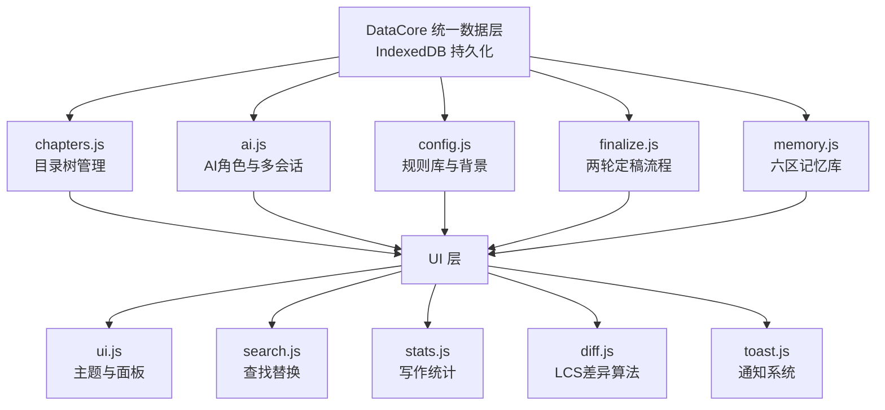

# 落笔 (Luobi)

> 写作内核驱动的 AI 协作写作引擎

[](LICENSE)

**落笔**是一款专注于长篇小说创作的 AI 辅助写作工具。它将你的写作规则编译为 AI 可执行的审查指令，并提供从创作、审稿到定稿的完整工作流。

---

## ✨ 功能

| 模块 | 功能 |
|------|------|
| ✍️ **编辑器** | 专注模式、查找替换、自动保存、字数统计、时速预估 |
| 🤖 **四角色 AI 协作** | 风格审核、剧情锚点、读者审阅、创作伙伴，各司其职 |
| 📋 **规则引擎** | 写作规则可视化编辑、AI 自动提取、冲突检测 |
| ✅ **两轮定稿制** | 第一轮锁定硬伤，第二轮 AI 自动提取亮点 |
| 🧠 **长期记忆库** | 六区结构化存储、三级实体识别、按需注入 |
| 🔍 **LCS 文本差异算法** | 基于最长公共子序列的自研实现，高亮草稿与定稿差异 |
| 📊 **写作统计** | 实时字数、全书总字数、时速预测 |
| 🎨 **四款主题** | 默认亮色、护眼绿、暖黄羊皮纸、深色模式 |
| 📂 **动态目录** | 卷/章管理、右键菜单、拖拽排序、导入导出 |

---

## 🏗️ 架构



**设计原则**：所有数据通过 `DataCore` 统一读写，模块之间通过事件总线通信，禁止直接操作 `localStorage`。

---

## 🧠 记忆库架构

落笔的记忆库采用六区结构，按生命周期分层：

| 层 | 区 | 内容 |
|----|-----|------|
| 常驻层 | 锚点 / 活跃状态 / 开放伏笔 | 每次对话自动注入摘要 |
| 按需层 | 角色档案 / 地点 / 伏笔详情 / 章节档案 | 实体识别命中时注入 |
| 冷存储层 | 历史章节档案 / 用户写作偏好 / 全局摘要 | 用户主动查询或导演规划时加载 |

**三级实体识别**：

1. 精确匹配：扫描实体索引表，零成本
2. 规则层：关键词映射（节奏/伏笔/整体），零成本
3. LLM 兜底：语义分类，带 confidence 阈值

---

## 🛠️ 技术栈

| 层级 | 技术 |
|------|------|
| **前端** | 纯原生 HTML/CSS/JavaScript，零框架依赖 |
| **AI 引擎** | DeepSeek API（支持标准对话 + 深度推理 R1） |
| **数据持久化** | IndexedDB（localStorage 作为 fallback） |
| **模块化** | IIFE + 全局事件总线，10 个独立 JS 模块 |
| **Markdown 渲染** | marked.js |
| **文本差异算法** | 自研 LCS 动态规划实现 |

---

## 🚀 快速开始

### 1. 克隆仓库

```bash
git clone https://github.com/yezi-04/luobi.git
cd luobi
```

### 2. 获取 DeepSeek API Key

前往 [DeepSeek 开放平台](https://platform.deepseek.com) 注册并获取 API Key。

### 3. 启动应用

用浏览器打开 `index.html`。推荐用本地服务器运行（避免 `file://` 协议限制）：

```bash
# 方式一：Python
python -m http.server 8000

# 方式二：VS Code Live Server 插件
# 右键 index.html → Open with Live Server
```

然后访问 `http://localhost:8000`。

### 4. 开始写作

- 在左侧目录树中管理章节
- 在中间编辑器中写作
- 选中文字后点击「分析模式」调用 AI 审稿
- 完成章节后使用「定稿」面板进行两轮定稿

---

## ⌨️ 快捷键

| 快捷键 | 功能 |
|--------|------|
| `Ctrl + F` | 查找 |
| `Ctrl + H` | 查找替换 |
| `Ctrl + S` | 保存当前章节 |
| `Enter` | 查找结果跳转 |
| `Escape` | 关闭查找栏 |

---

## 📝 使用场景

落笔最初是为作者的小说《荒芜星环》量身定制的写作工具。它的规则引擎可以将任何写作规范（如白描准则、道具规范、台词铁律等）编译为 AI 可执行的审查规则。

如果你有自己的写作规范，可以使用「🧠 AI 提取规则」功能，粘贴你的写作内核，AI 会自动生成对应的审查规则。

---

## 🔮 已知问题与后续规划

当前版本（v1.x）定位为**个人创作工具**，以下问题已识别，按优先级规划修复：

| 优先级 | 问题 | 计划 |
|--------|------|------|
| P0 | 规则引擎本质是 Prompt 模板拼接，缺少结构化解析 | v2.1 增加规则类型/优先级/触发条件 |
| P0 | 两轮定稿均调用同一 API，缺少差异化策略 | v2.1 不同轮次使用不同提示词和温度 |
| P1 | 重新定稿时，档案字段合并逻辑不完整 | v2.1 完善档案管理 UI |
| P1 | 用户写作偏好采集尚未实现 | v2.2 从修改历史自动提取 |
| P2 | 无自动化测试覆盖 | v2.2 为核心模块添加单元测试 |
| P2 | 缺少 Electron 桌面封装 | v3.0 实现本地文件系统读写 |
| P2 | 不支持多模型（OpenAI / Claude） | v3.0 引入模型适配层 |

---

## 📄 许可证

MIT License © 2026

---

## 🙏 致谢

- [DeepSeek](https://deepseek.com) 提供强大的 AI 模型支持
- [marked.js](https://github.com/markedjs/marked) 提供 Markdown 渲染

---

*「落笔」—— 让 AI 理解你的写作规矩。*

---
